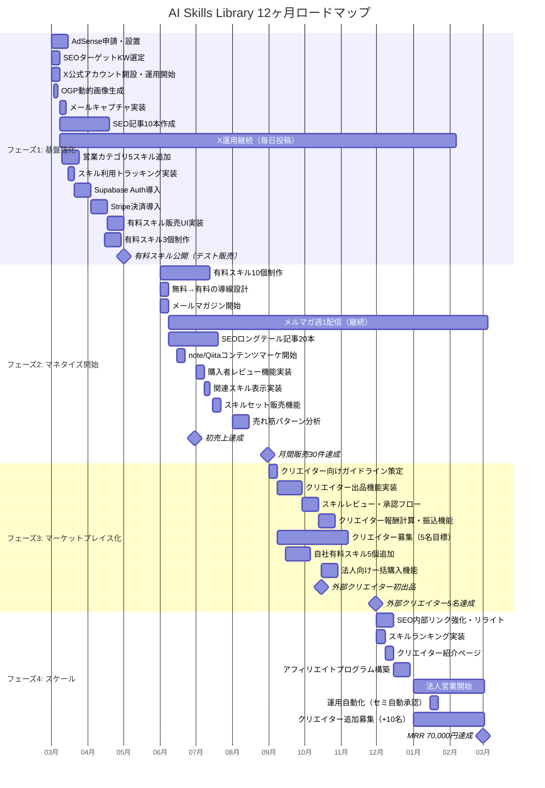

# AI Skills Library - 12ヶ月ガントチャート

> 作成日: 2026年2月25日
> 期間: 2025年3月〜2026年3月
> 前提: 個人〜2名体制で実行

---

## Mermaid ガントチャート



---

## テキスト版ガントチャート

凡例: `████` = 作業期間、`(M)` = マイルストーン、`-->` = 依存関係

### フェーズ1: 基盤強化（2025年3月〜5月）

```
2025年          3月              4月              5月
                W1  W2  W3  W4  W1  W2  W3  W4  W1  W2  W3  W4
─────────────────────────────────────────────────────────────────
[開発]
AdSense申請     ████████
OGP動的画像         ██
メールキャプチャ     ████
トラッキング実装         ████
Supabase Auth           ████████
  └→ Stripe決済                 ████████
      └→ 有料販売UI                     ████████
           └→ テスト販売開始                    (M)

[コンテンツ]
KW選定          ████
  └→ SEO記事10本    ████████████████████████████
営業5スキル追加     ████████
有料スキル3個制作                ████████

[マーケティング]
X開設・運用開始 ██── 継続運用 ──────────────────────>
```

**担当:** 全タスク自社（開発者1名）
**依存関係:**
- Stripe決済 → Supabase Auth完了後
- 有料販売UI → Stripe導入完了後
- SEO記事 → KW選定完了後

**フェーズ1完了条件:**
- [ ] Supabase Auth + Stripe + 有料販売UIが動作する
- [ ] AdSenseが承認され広告が表示されている
- [ ] 有料スキル3個が公開されている
- [ ] メールキャプチャが稼働し、リストが蓄積され始めている

---

### フェーズ2: マネタイズ開始（2025年6月〜8月）

```
2025年          6月              7月              8月
                W1  W2  W3  W4  W1  W2  W3  W4  W1  W2  W3  W4
─────────────────────────────────────────────────────────────────
[開発]
導線設計        ████
レビュー機能                    ████
関連スキル表示                      ████
セット販売機能                          ████

[コンテンツ]
有料スキル10個   ████████████████████████████
メルマガ開始    ██── 週1配信 ──────────────────────>
SEO記事20本         ████████████████████████
note/Qiita開始      ██── 継続 ────────────────>

[分析]
売れ筋分析                                      ████████
初売上達成              (M)
月間30件達成                                            (M)
```

**担当:** 全タスク自社（開発者1名 + コンテンツ兼任）
**依存関係:**
- 有料スキル制作はフェーズ1の販売基盤完成が前提
- レビュー機能は初期販売データ蓄積後に価値が出る

**フェーズ2完了条件:**
- [ ] 有料スキル13個が公開されている
- [ ] 月間販売30件を達成
- [ ] 売れ筋スキルのパターンが特定できている
- [ ] メルマガ登録500件以上

---

### フェーズ3: マーケットプレイス化（2025年9月〜11月）

```
2025年          9月              10月             11月
                W1  W2  W3  W4  W1  W2  W3  W4  W1  W2  W3  W4
─────────────────────────────────────────────────────────────────
[開発]
ガイドライン策定 ████
  └→ 出品機能         ████████████
      └→ 承認フロー                ████████
          └→ 報酬計算                       ████████
法人一括購入                        ████████

[コンテンツ]
自社スキル5個追加    ████████████

[マーケティング]
クリエイター募集 ████── 継続 ──────────────────────>
外部初出品                          (M)
外部5名達成                                             (M)
```

**担当:**
- 開発: 自社（開発者1名）
- ガイドライン: 自社（必要に応じ弁護士レビュー）
- クリエイター募集: 自社

**依存関係:**
- 出品機能 → ガイドライン策定完了後
- 承認フロー → 出品機能完了後
- 報酬計算 → 承認フロー完了後
- クリエイター募集はガイドライン完成次第開始可能

**フェーズ3完了条件:**
- [ ] 外部クリエイター5名がアクティブに出品している
- [ ] 外部スキル15個が公開されている
- [ ] 月間販売100件を達成
- [ ] 報酬の自動計算が機能している

---

### フェーズ4: スケール（2025年12月〜2026年3月）

```
2025-2026年     12月             1月              2月              3月
                W1  W2  W3  W4  W1  W2  W3  W4  W1  W2  W3  W4  W1  W2  W3  W4
────────────────────────────────────────────────────────────────────────────────
[開発]
ランキング実装  ████
紹介ページ          ████
アフィリエイト           ████████
運用自動化                          ████

[マーケティング]
SEOリライト     ████████
法人営業                    ████████████████████████████████████
クリエイター追加募集        ████████████████████████████████████

[目標]
MRR 70,000円達成                                                        (M)
```

**担当:**
- 開発: 自社（週5-10h）
- 法人営業: 自社
- クリエイター管理: 自社（週2-3h）

**フェーズ4完了条件:**
- [ ] MRR 70,000円を安定的に達成
- [ ] 月間作業時間が10時間以内
- [ ] クリエイター10名がアクティブ
- [ ] 法人契約1社以上

---

## 月別の作業時間見積もり

| 月 | 開発 | コンテンツ | マーケ | 管理 | 合計/週 | 備考 |
|----|------|-----------|--------|------|---------|------|
| 3月 | 15h | 5h | 3h | 0h | 23h | 認証・決済の集中開発 |
| 4月 | 15h | 8h | 3h | 0h | 26h | 販売UI + スキル制作 |
| 5月 | 10h | 8h | 3h | 0h | 21h | テスト販売・調整 |
| 6月 | 5h | 10h | 5h | 0h | 20h | スキル制作集中 |
| 7月 | 8h | 8h | 5h | 0h | 21h | レビュー・関連機能 |
| 8月 | 3h | 8h | 5h | 0h | 16h | 分析・改善 |
| 9月 | 12h | 5h | 5h | 2h | 24h | マーケットプレイス開発 |
| 10月 | 10h | 3h | 5h | 3h | 21h | 承認・報酬機能 |
| 11月 | 5h | 3h | 5h | 3h | 16h | 安定化 |
| 12月 | 8h | 0h | 3h | 3h | 14h | ランキング・アフィリエイト |
| 1月 | 3h | 0h | 5h | 3h | 11h | 法人営業注力 |
| 2月 | 2h | 0h | 3h | 3h | 8h | 自動運用化 |
| 3月 | 2h | 0h | 3h | 3h | 8h | キャッシュカウ状態 |

---

## クリティカルパス

以下のタスクが遅延すると全体スケジュールに影響する。

```
Supabase Auth導入（3月W3-4）
    ↓
Stripe決済導入（4月W1-2）
    ↓
有料販売UI実装（4月W3-5月W1）
    ↓
初の有料スキル公開（5月末）  ← ★ 遅くとも5月末に有料販売を開始しないと全体が遅延
    ↓
有料スキル10個制作（6-7月）
    ↓
売れ筋パターン特定（8月）   ← ★ ここでの学びがフェーズ3以降の品揃えを決める
    ↓
クリエイター出品機能（9-10月）
    ↓
外部クリエイター5名獲得（11月） ← ★ ネットワーク効果の起点
    ↓
MRR 70,000円達成（3月）
```

**最大のリスクポイント:** 5月末までに有料販売を開始できるかどうか。ここが3ヶ月以上遅延すると、12ヶ月でのキャッシュカウ化は困難になる。

---

## 判断ポイントまとめ

| 時期 | チェック項目 | Go条件 | Stop/Pivot条件 |
|------|------------|--------|----------------|
| 5月末 | 有料販売基盤 | 技術的に販売可能 | 実装が完了しない → 外部決済サービス（Gumroad等）で代替 |
| 8月末 | 初期販売結果 | 月間販売10件以上 | 販売0件 → 価格・スキル内容の全面見直し |
| 11月末 | マーケットプレイス | 外部クリエイター3名以上 | 0名 → 自社販売特化に方針転換 |
| 3月末 | MRR | 30,000円以上 | 10,000円未満 → 売却検討 |
